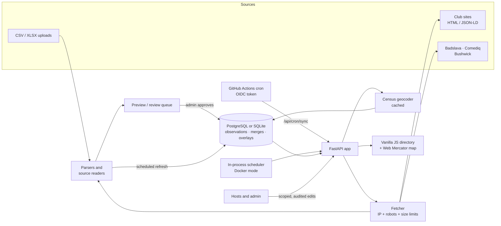

<div align="center">


# NYC Open Mic Master List

**A self-updating directory of New York City stand-up open mics: it polls club sites and listing feeds, maps every mic across the five boroughs, and lets verified hosts maintain their own listings.**

[](.python-version)
[](requirements.txt)
[](https://github.com/taylordrew4u2/nycstandupopenmicmaster/actions/workflows/test.yml)
[](docs/deployment.md)
[](docs/deployment.md)

[**Live site**](https://nycopenmicmasterlist.com) · [**Docs**](docs/) · [Administration](docs/administration.md) · [Deployment](docs/deployment.md) · [Testing](docs/testing.md)


<sub>Recorded locally in the app's demo mode with fictional mics. Map tiles &copy; OpenStreetMap contributors.</sub>

</div>

## Why I built it

NYC open mic schedules are spread across club websites, aggregator feeds and shared
spreadsheets, and they go stale quickly. This project pulls those sources into one
mobile-first directory, keeps it current on a schedule, and makes sure a bad import or a
vanished row never silently overwrites good data.

## Highlights

- **Scheduled multi-source ingestion.** Ten adapters (CSV, XLSX, JSON, HTML tables, JSON-LD,
  CSS-selector cards, plus dedicated Badslava, Comediq, Bushwick Comedy Club and official
  club-schedule readers) are polled on per-source intervals and merged by configured priority,
  never by guessing which value is newest.
- **Review before publish.** Every new source goes through a preview step in the admin panel.
  Conflicts and rows that disappear from a source are flagged for review instead of deleted,
  and a failed fetch keeps the last good data.
- **SSRF-hardened fetching.** `app/fetcher.py` validates the resolved IP on every connection
  (blocking private, reserved and link-local ranges), honors robots.txt across redirects, and
  caps request size, redirect count and total time below the source's lease.
- **Secretless scheduled syncs.** On Vercel, a GitHub Actions cron calls the sync endpoint with
  a short-lived OIDC token. The server pins the repository ID, owner ID, branch and workflow, so
  CI holds no long-lived credential; a database lease stops overlapping batches.
- **Scoped host accounts.** Claims are admin-verified and issue single-use, seven-day
  invitations. Tokens are stored as SHA-256 hashes, passwords use PBKDF2 (600k rounds), and
  every host write is checked against the mics that host owns.
- **No map library.** `assets/map.js` is a dependency-free Web Mercator renderer with pin
  grouping and anchored pinch zoom that loads only the visible OpenStreetMap tiles.

## Features

| Area | What it does |
| --- | --- |
| **Directory** | Search and filter by day, calendar date, borough, fee, signup method and host status; saved mics and CSV export |
| **Map** | Five-borough map with grouped pins, a color legend and touch gestures (pinch, pan, double-tap) |
| **Provenance** | Source links, last-checked time, conflict and stale warnings, and a "Venue confirmed" badge for official club listings |
| **Geocoding** | US Census geocoder with cached results; approximate matches are labeled as such |
| **Community** | Public "Submit a fix", "Report inactive" and "Submit a mic" flows feeding a private review queue |
| **Hosts** | Claim a mic, accept an invitation, edit only approved listings; claims carry forward to future dated occurrences |
| **Admin** | Sources, import previews, submissions, claims, host access, audit log and About page copy |
| **Privacy** | Visitor counts from a hashed cookie, no IP storage, and DNT / GPC honored |

## Screenshots

<table>
  <tr>
    <td width="50%"></td>
    <td width="50%"></td>
  </tr>
  <tr>
    <td align="center"><sub><b>Directory and map</b></sub></td>
    <td align="center"><sub><b>Filtered to Brooklyn, $5 or less</b></sub></td>
  </tr>
  <tr>
    <td></td>
    <td></td>
  </tr>
  <tr>
    <td align="center"><sub><b>Mic details</b></sub></td>
    <td align="center"><sub><b>Admin: preview before publishing</b></sub></td>
  </tr>
  <tr>
    <td colspan="2" align="center"><br><sub><b>Phone layout (390px)</b></sub></td>
  </tr>
</table>

## Architecture



**Design decisions**

- **Layered data model.** Raw source observations, priority-ranked merges and manual or host
  overlays are stored separately, so human edits survive re-syncs and imported values can be restored.
- **Flag, don't delete.** Missing rows and conflicting values go to review. Readers never infer
  times, boroughs or recurrence a source does not state, because a wrong listing costs a comic a trip.
- **One codebase, two databases.** PostgreSQL backs the serverless Vercel deployment; SQLite keeps
  Docker and local runs to a single container. CI runs storage-dependent tests against PostgreSQL 16.
- **Plain frontend.** No framework or map SDK keeps the page small and the behavior fully testable
  in Playwright with an in-process API transport.

## Tech stack

| Layer | Technology |
| --- | --- |
| Backend | Python, FastAPI, uvicorn |
| Data | PostgreSQL (psycopg 3) in production, SQLite locally and in Docker |
| Ingestion | aiohttp, Beautiful Soup, openpyxl |
| Frontend | Vanilla JavaScript, HTML, CSS; custom Web Mercator map over OpenStreetMap tiles |
| Auth | Server-side sessions, same-origin write checks, GitHub OIDC (PyJWT) for scheduled jobs |
| Testing | pytest, Playwright (Chromium), GitHub Actions with PostgreSQL 16 |
| Hosting | Vercel (serverless) or Docker; optional Render blueprint |

## Getting started

Requires Python 3.11+.

```bash
python3 -m venv .venv && source .venv/bin/activate
pip install -r requirements.txt
export ADMIN_PASSWORD='choose-at-least-15-characters' LOCAL_DEV=1 SCHEDULER_ENABLED=1
uvicorn app.main:app --host 127.0.0.1 --port 8000 --workers 1
```

Or with Docker (SQLite on a named volume, bound to `127.0.0.1:8000`):

```bash
ADMIN_PASSWORD='choose-at-least-15-characters' docker compose up --build
```

Open `http://127.0.0.1:8000`, sign in at `/admin`, add a source, preview the extracted listings
and approve the import. The site starts empty. On macOS, `Start-Mic-List.command` does all of
this in one double-click. All settings are listed in [`.env.example`](.env.example).

## Testing

```bash
pip install -r requirements-dev.txt
python -m pytest -q tests          # 167 tests
```

The pytest suite (167 tests) covers auth, CSRF, owner scoping, claims and invitations,
rate limits, every parser and source reader, failure retention, fetch restrictions,
concurrent source leases and rejection of unauthorized GitHub identities. Set
`TEST_DATABASE_URL` to also run it against PostgreSQL, as CI does on every push.

Separate Playwright scripts check filtering, map grouping, touch gestures, pagination,
admin workflows and nine viewport sizes from 320x400 to 1440x900. See
[docs/testing.md](docs/testing.md).

## Project structure

```
app/          FastAPI app: routes, auth, storage, scheduling, geocoding
  parsers.py    generic CSV / XLSX / JSON / HTML adapters
  fetcher.py    size-limited, robots-aware, public-IP-only fetching
  community.py  submissions, claims, host accounts
  badslava.py, comediq.py, bushwick.py, club_sources.py   source readers
assets/       static frontend (HTML, CSS, vanilla JS, map renderer)
scripts/      scheduled sync trigger, backup, preview build
tests/        pytest suite and Playwright browser checks
docs/         administration, deployment, directory and testing guides
```

## Documentation

- [Administration](docs/administration.md): sources, field schema, moderation, claims, host accounts
- [Public directory](docs/directory.md): filters, map, gestures, visitor counts, shop
- [Deployment and operations](docs/deployment.md): Vercel, Docker, environment, backups
- [Testing](docs/testing.md): backend and browser coverage
- [Search visibility](docs/search-visibility.md): crawlable mic pages and sitemap

---

<div align="center">

Built by **Taylor Drew** · [github.com/taylordrew4u2](https://github.com/taylordrew4u2)

<sub>No open-source license has been granted; all rights reserved.</sub>

</div>
