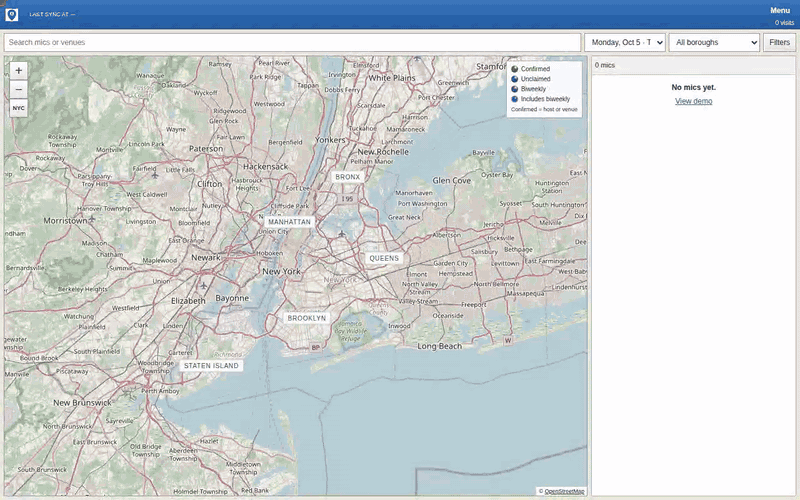
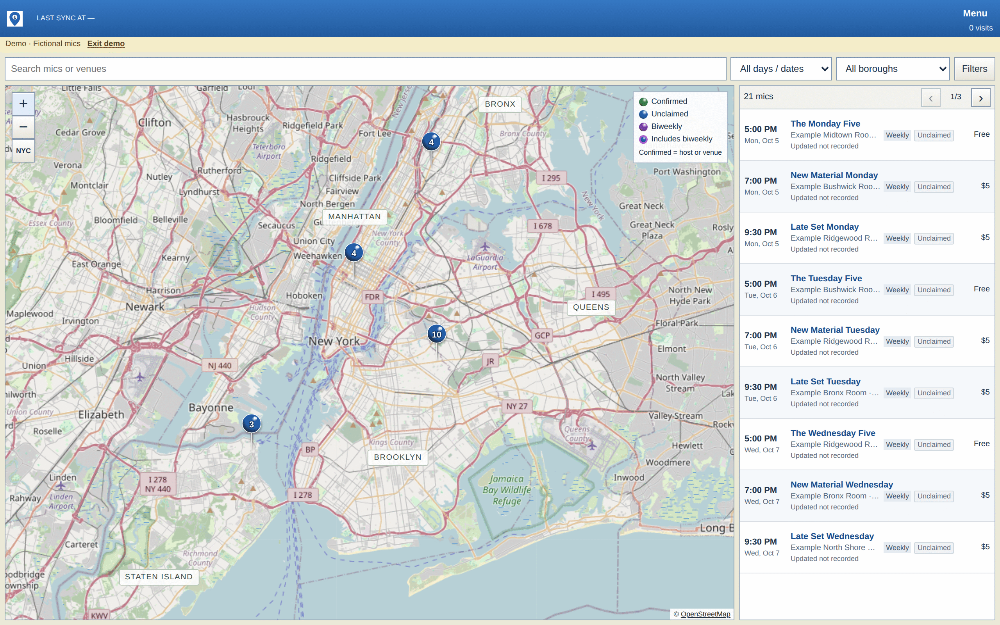
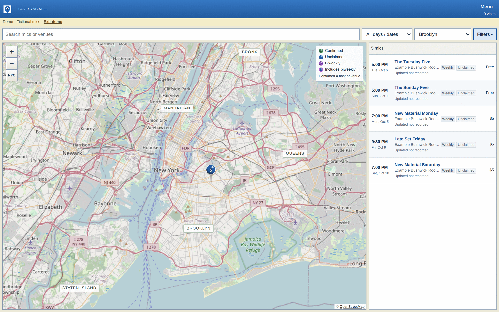
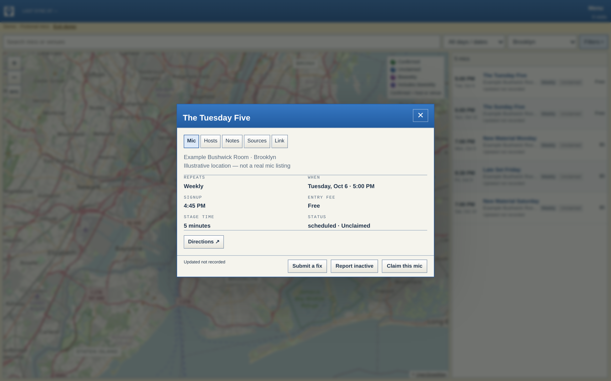
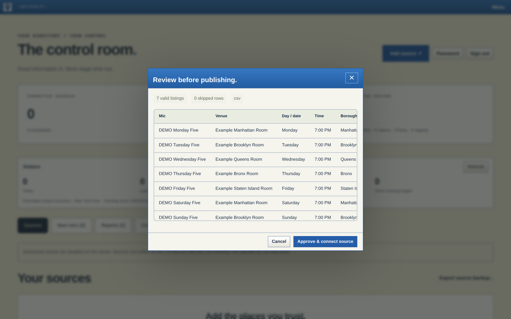
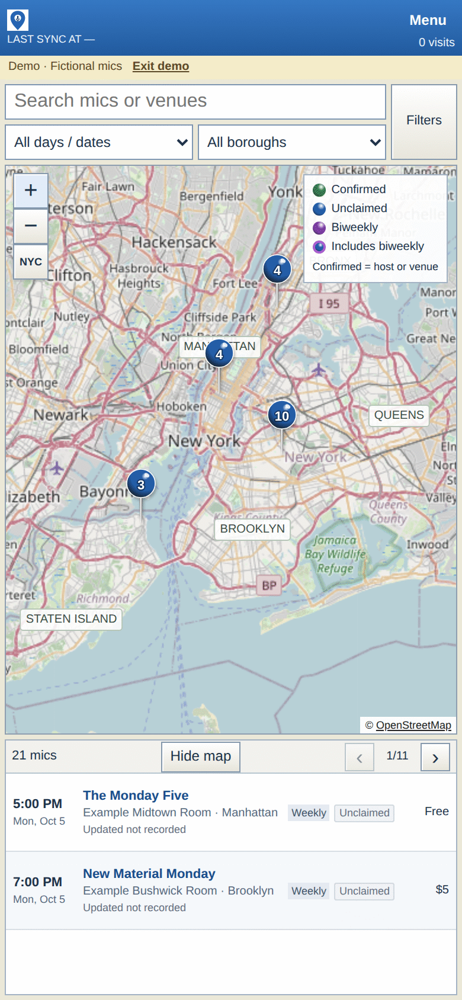

# NYC Open Mic Master List

**A self-updating directory of New York City stand-up open mics that pulls listings from many sources, puts them on a five-borough map, and lets real hosts claim and maintain their own mics.**

[](https://nycopenmicmasterlist.com)


## Demo



*Recorded from a local run using the app's built-in demo mode, which shows fictional
example mics. Map tiles are from OpenStreetMap.*

## Overview

Open mic schedules in NYC are scattered across club websites, aggregator feeds and
spreadsheets, and they go stale fast. This project consolidates them into one
searchable, mobile-first directory. Sources are polled on a schedule, merged by
priority, and flagged for review when they conflict or disappear, so a bad import
never silently wipes out good data. Hosts can verify ownership of a mic and edit it
directly, with every change scoped and audited.

## Key features

**Public directory**
- Search and filter by day, exact date (calendar), borough, fee, signup method and host status.
- Five-borough map with grouped pins, a color legend and touch gestures (pinch, pan, double-tap).
- Single-viewport layout that adapts its row count to the screen, from 320px phones to desktop.
- Provenance on every listing: source links, last-checked time, conflicts and stale warnings.
- Weekly, biweekly and one-time mics labeled; "Venue confirmed" for listings found on official club sites.
- Saved mics (local to the browser) and CSV export.

**Source ingestion**
- Adapters for CSV, XLSX, JSON, HTML tables, JSON-LD events and CSS-selector card layouts.
- Dedicated readers for Badslava, Comediq, Bushwick Comedy Club and a catalog of official club schedules.
- Preview-before-publish imports, per-source refresh intervals, and priority-based conflict resolution.
- Manual and host edits are preserved across syncs; failed imports keep the last good data.
- Address geocoding via the US Census geocoder, with cached and clearly labeled approximate matches.

**Community and moderation**
- Public "Submit a fix", "Report inactive" and "Submit a mic" flows with a private review queue.
- Claim workflow: admin-verified claims issue single-use, seven-day host invitations.
- Host dashboard scoped to approved mics only; claims carry forward to future dated occurrences.
- Admin control room for sources, submissions, claims, host access, the audit log and About page copy.
- Privacy-preserving visitor counts (hashed cookie, no IPs; honors DNT and GPC).

## Screenshots

| Directory and map | Filtered to Brooklyn, $5 or less |
| --- | --- |
|  |  |
| **Mic details** | **Admin: preview before publishing** |
|  |  |

<p align="center"></p>

## Tech stack

| Layer | Technology |
| --- | --- |
| Backend | Python, FastAPI, uvicorn |
| Data | PostgreSQL (psycopg 3) in production, SQLite for local or single-host deployments |
| Ingestion | aiohttp, Beautiful Soup, openpyxl |
| Frontend | Vanilla JavaScript, HTML and CSS; custom Web Mercator map over OpenStreetMap tiles |
| Security | Server-side sessions, same-origin write checks, GitHub OIDC (PyJWT) for scheduled jobs |
| Testing | pytest, Playwright (Chromium), GitHub Actions against PostgreSQL 16 |
| Hosting | Vercel (serverless) or Docker |

## Engineering highlights

- **No framework, no map library.** The frontend is plain JavaScript, and `assets/map.js`
  is a dependency-free Web Mercator renderer with pin clustering and anchored pinch zoom
  that fetches only visible tiles.
- **Defensive ingestion.** Source fetches honor robots rules and enforce request, redirect,
  size and public-network limits. Missing rows are flagged for review rather than deleted,
  and readers never guess times, boroughs or recurrence that the source does not state.
- **Layered data model.** Raw source observations, priority-ranked merges and manual/host
  overlays are stored separately, so edits survive re-syncs and imported values can be restored.
- **Credential-free scheduling.** On Vercel, a GitHub Actions workflow triggers syncs using
  short-lived OIDC tokens. The server pins the repository and owner IDs, branch, workflow
  and event, so no long-lived secret lives in CI. A database lease prevents overlapping batches.
- **Scoped, auditable access.** Invitation tokens and sessions are stored hashed, claim
  links carry tokens in URL fragments to keep them out of access logs, host permissions are
  checked on every write, and revocation is immediate.
- **Dual database support.** The same code runs on PostgreSQL or SQLite, and CI exercises
  storage-dependent tests against both.

## Getting started

### macOS one-click launcher

Requires Python 3.11+.

```bash
bash Start-Mic-List.command   # or double-click it in Finder
```

The script creates a virtual environment, installs dependencies, prompts for an admin
password (at least 15 characters), and serves the site at `http://127.0.0.1:8000`.
Sign in at `/admin`, add a source, preview the extracted listings and approve the import.
The site starts empty; no demo data is seeded.

### Manual setup

```bash
python3 -m venv .venv && source .venv/bin/activate
pip install -r requirements.txt
export ADMIN_PASSWORD='choose-at-least-15-characters' LOCAL_DEV=1 SCHEDULER_ENABLED=1
uvicorn app.main:app --host 127.0.0.1 --port 8000 --workers 1
```

### Docker

```bash
ADMIN_PASSWORD='choose-at-least-15-characters' docker compose up --build
```

`compose.yaml` builds the image, stores SQLite on a named volume, and binds to
`127.0.0.1:8000` for local use. See [`.env.example`](.env.example) for all settings.

## Testing

```bash
pip install -r requirements-dev.txt
python -m pytest -q tests
```

Set `TEST_DATABASE_URL` to a disposable PostgreSQL database to also run the suite
against PostgreSQL. Playwright browser checks cover filtering, map grouping, nine
viewport sizes, pagination, admin workflows and touch gestures. See
[docs/testing.md](docs/testing.md) for the full test matrix.

## Project structure

```
app/            FastAPI app: routes, auth, storage, scheduling, source adapters
  main.py         entrypoint and core routes
  community.py    submissions, claims, host accounts
  parsers.py      generic CSV/XLSX/JSON/HTML adapters
  badslava.py, comediq.py, bushwick.py, club_sources.py   source-specific readers
assets/         static frontend (HTML, CSS, vanilla JS, map renderer)
scripts/        backup, preview build, scheduled sync trigger
tests/          pytest suite and Playwright browser checks
examples/       CSV import template and fictional demo data
docs/           administration, deployment, directory and testing guides; media/ holds README images
```

## Deployment

Production runs on **Vercel** with hosted **PostgreSQL**, with source checks triggered
every 15 minutes by an OIDC-authenticated GitHub Actions workflow. A **Docker** image
(and an optional Render blueprint) supports always-on hosting with SQLite and an
in-process scheduler. Step-by-step instructions, environment variables and backup
procedures are in [docs/deployment.md](docs/deployment.md).

## Documentation

- [Administration guide](docs/administration.md): sources, field schema, moderation, claims and host accounts
- [Public directory](docs/directory.md): filters, map, gestures, visitor counts, shop
- [Deployment and operations](docs/deployment.md): Vercel, Docker, environment, backups
- [Testing](docs/testing.md): backend and browser test coverage

## Author

Built by **Taylor Drew** ([@taylordrew4u2](https://github.com/taylordrew4u2)).

No open-source license has been granted; all rights reserved.
